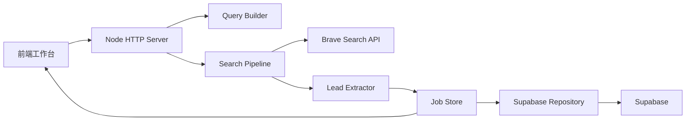

# 国际化 Leads 搜寻产品技术方案

## 1. 文档概览

- 文档名称：International Leads Finder Technical Spec
- 文档类型：技术方案 / Tech Spec
- 版本：v1.0
- 日期：2026-05-14
- 对应文档：
  - [product-brd.md](./product-brd.md)
  - [product-prd.md](./product-prd.md)

## 2. 技术目标

本方案目标是为国际化公开 leads 搜索产品提供一套可部署、可扩展、可维护的实现方案，覆盖：

- 搜索任务创建
- Query Plan 生成
- Brave Search 调用
- 线索结构化抽取
- 去重与质量分层
- Supabase 数据持久化
- 前端任务工作台
- Railway / Zeabur 部署

## 3. 总体架构

系统采用轻量单体结构：

- 前端：静态 HTML + CSS + 原生 JavaScript
- 后端：Node.js 原生 HTTP Server
- 搜索源：Brave Search API
- 数据库：Supabase Postgres + REST API
- 实时进度：SSE

### 3.1 架构图



## 4. 代码结构

当前项目结构：

```text
public/
  index.html
  app.js
  styles.css

src/
  brave-client.js
  config.js
  lead-extractor.js
  job-store.js
  query-builder.js
  search-pipeline.js
  structured-output.js
  supabase.js
  utils.js

supabase/migrations/
  20260514_create_lead_search_tables.sql

server.js
```

## 5. 模块设计

### 5.1 `server.js`

职责：

- 启动 HTTP 服务
- 提供 REST API
- 提供 SSE 接口
- 托管静态前端资源

核心接口：

- `GET /api/health`
- `GET /api/options`
- `GET /api/jobs`
- `POST /api/jobs`
- `GET /api/jobs/:id`
- `GET /api/jobs/:id/events`
- `GET /api/jobs/:id/leads`
- `GET /api/jobs/:id/stream`
- `POST /api/jobs/:id/cancel`
- `GET /api/jobs/:id/export.csv`

### 5.2 `src/config.js`

职责：

- 读取 `.env`
- 提供平台、国家、行业、池类型配置
- 返回应用运行配置

输出内容包括：

- `PLATFORM_OPTIONS`
- `POOL_TYPES`
- `INDUSTRY_PRESETS`
- `COUNTRY_PRESETS`
- `getAppConfig()`

### 5.3 `src/query-builder.js`

职责：

- 校验并标准化用户搜索输入
- 根据国家、行业、池类型和平台生成 query plan

输入：

- 搜索词
- 区号
- 国家/城市
- 行业组
- 池类型
- 平台
- 最大查询数

输出：

- `normalizedInput`
- `queryPlan`

### 5.4 `src/brave-client.js`

职责：

- 封装 Brave Search API 调用
- 标准化返回结果
- 识别 quota 和错误信息

核心函数：

- `search()`
- `normalizeBraveResults()`
- `getBraveErrorMessage()`
- `isQuotaLimited()`

### 5.5 `src/lead-extractor.js`

职责：

- 从搜索结果中提取结构化线索
- 标准化手机号
- 识别业务信号和噪声信号
- 计算质量层级和置信度
- 合并重复命中 leads

核心函数：

- `extractLeadCandidates()`
- `mergeLeadRecords()`

### 5.6 `src/job-store.js`

职责：

- 管理任务、事件、leads 的内存态
- 向前端广播 SSE 事件
- 调用 repository 进行持久化

核心能力：

- 创建任务
- 查询任务
- 查询任务历史
- 查询事件
- 查询 leads
- 更新任务进度
- 新增事件
- upsert lead

### 5.7 `src/supabase.js`

职责：

- 通过 Supabase REST API 持久化数据
- 读取 jobs / events / leads
- 处理 URL 兼容逻辑

核心能力：

- `persistJob()`
- `updateJob()`
- `persistEvent()`
- `upsertLead()`
- `fetchJob()`
- `fetchJobs()`
- `fetchJobEvents()`
- `fetchJobLeads()`

### 5.8 `src/search-pipeline.js`

职责：

- 负责任务执行主流程
- 依次调用 Brave 查询
- 抽取 leads
- 更新任务状态和进度
- 记录事件日志
- 支持取消任务

核心流程：

1. 读取任务
2. Brave preflight
3. 逐条执行 query
4. 抽取并 upsert leads
5. 更新统计
6. 输出最终完成状态

### 5.9 `src/structured-output.js`

职责：

- 生成导出结构
- 将 leads 映射为参考表标准列

输出列包括：

- 国家
- 行业组
- 公司/页面
- 手机
- Facebook链接
- 类目英文
- 类目本地语言
- 命中关键词
- 摘要

## 6. 数据流设计

### 6.1 任务创建数据流

1. 前端提交搜索表单到 `POST /api/jobs`
2. 服务端调用 `normalizeSearchPayload()`
3. 服务端调用 `buildQueryPlan()`
4. `JobStore.createJob()` 建立任务
5. 任务数据写入 `lead_search_jobs`
6. 服务端返回 job 给前端
7. 后台异步触发 `SearchPipeline.runJob()`

### 6.2 搜索执行数据流

1. `SearchPipeline` 执行 Brave preflight
2. 顺序执行每个 query
3. 对每条 Brave result 调用 `extractLeadCandidates()`
4. 使用 `dedupe_key` 做 upsert
5. 更新任务进度和统计
6. 通过 SSE 推送到前端

### 6.3 结果回看数据流

1. 前端请求 `GET /api/jobs`
2. 选择任务后请求：
   - `GET /api/jobs/:id`
   - `GET /api/jobs/:id/events`
   - `GET /api/jobs/:id/leads`
3. 前端加载完整任务上下文

## 7. 数据库设计

### 7.1 表结构

#### `lead_search_jobs`

主要存储：

- 输入参数
- query plan
- 任务状态
- 进度信息
- 查询统计
- leads 统计

#### `lead_search_job_events`

主要存储：

- job 生命周期事件
- query 开始/完成/失败事件
- 失败原因

#### `leads`

主要存储：

- 页面基础信息
- 手机号
- 命中 query
- 平台
- 质量分层
- 原始提取片段

### 7.2 关键约束

- `leads.dedupe_key` 需支持 upsert
- `lead_search_job_events.job_id` 关联 `lead_search_jobs.id`
- `leads.job_id` 关联 `lead_search_jobs.id`

## 8. 去重与质量规则

### 8.1 去重规则

当前去重主键逻辑：

`canonicalUrl + "::" + phone`

优势：

- 同一页面相同号码可稳定归并
- 能保留一个页面多个号码的情况

### 8.2 质量规则

当前结果分为：

- `refined`
- `broad`

规则来自：

- 区号是否匹配
- 是否包含 importer / distributor / supplier 等信号
- 是否包含行业词
- 是否命中 china 相关信号
- 是否命中 noise 词

## 9. 实时通信方案

使用 SSE。

### 9.1 原因

- 实现简单
- 单向推送足够满足任务进度场景
- 不需要 WebSocket 的双向复杂性

### 9.2 推送事件类型

- `job`
- `event`
- `lead`

前端收到后分别更新：

- 任务统计
- 日志列表
- leads 表格

## 10. 前端实现方案

### 10.1 技术选型

- 原生 HTML
- 原生 JS
- 原生 CSS

### 10.2 原因

- MVP 结构简单
- 无需额外构建工具
- 适合快速部署到 Railway / Zeabur

### 10.3 页面能力

- 搜索表单
- 任务历史
- 当前任务概览
- Query 计划
- 日志事件流
- Leads 表
- 详情弹窗

### 10.4 前端状态

当前主要状态包括：

- `options`
- `jobs`
- `currentJob`
- `events`
- `leads`
- `filter`
- `platformFilter`
- `leadSearchTerm`
- `eventSource`

## 11. API 设计

### 11.1 `GET /api/health`

返回：

- 服务是否正常
- Brave 是否配置
- Supabase 是否配置

### 11.2 `GET /api/options`

返回：

- 平台选项
- 国家选项
- 行业组选项
- 线索池选项

### 11.3 `GET /api/jobs`

返回最近任务列表。

用途：

- 前端最近任务面板

### 11.4 `POST /api/jobs`

输入：

- 搜索条件

输出：

- 新创建的 job

### 11.5 `GET /api/jobs/:id`

返回任务详情。

### 11.6 `GET /api/jobs/:id/events`

返回任务事件流历史。

### 11.7 `GET /api/jobs/:id/leads`

返回任务 leads 列表。

支持：

- `qualityTier` 查询参数

### 11.8 `GET /api/jobs/:id/stream`

SSE 实时流。

### 11.9 `POST /api/jobs/:id/cancel`

取消任务。

### 11.10 `GET /api/jobs/:id/export.csv`

导出 CSV。

支持：

- 全量
- refined 导出

## 12. 环境变量

必需变量：

- `PORT`
- `APP_BASE_URL`
- `BRAVE_API_KEY`
- `SUPABASE_URL`
- `SUPABASE_SERVICE_ROLE_KEY`

可选变量：

- `DEFAULT_BRAVE_COUNTRY`
- `DEFAULT_SEARCH_LANG`

## 13. 部署方案

### 13.1 GitHub

用于代码托管与版本管理。

### 13.2 Railway

部署方式：

- 直接使用根目录 `Dockerfile`

所需配置：

- Brave key
- Supabase URL
- Supabase service role key

### 13.3 Zeabur

部署方式：

- 直接使用根目录 `Dockerfile`

所需配置：

- Brave key
- Supabase URL
- Supabase service role key

## 14. 错误处理

### 14.1 Brave 层

- preflight 失败
- quota 限额
- query 执行失败

处理方式：

- 记录事件
- 更新 job 状态
- 在必要时直接 fail 任务

### 14.2 Supabase 层

- 写入失败时记录错误日志
- 当前设计优先保证主流程不中断

### 14.3 前端层

- fetch 失败提示
- `file://` 预览模式提示
- SSE 中断提示

## 15. 安全设计

### 15.1 密钥管理

- Brave key 仅保存在服务端
- Supabase service role 仅保存在服务端
- `.env` 不纳入版本控制

### 15.2 风险点

- 对话中曾明文暴露 key，建议部署后轮换
- service role 权限较高，不可在前端暴露

## 16. 扩展方向

### 16.1 业务扩展

- 扩展更多国家模板
- 扩展更多行业规则
- 增加 Excel 导出
- 增加任务标签与批量操作

### 16.2 技术扩展

- 增加 query 原始结果落盘
- 增加异步任务队列
- 增加 AI 分类与摘要增强
- 增加定时任务与监控

## 17. 当前实现与方案一致性

当前代码已经覆盖以下技术方案内容：

- API 服务
- Brave 搜索封装
- Query Plan 生成
- Leads 提取与质量分层
- Supabase 三表持久化
- 最近任务列表
- SSE 任务进度
- CSV 导出

尚未完全实现但在方案中预留的部分包括：

- Excel 导出
- AI 增强评分
- 多用户权限
- CRM 集成

## 18. 结论

当前技术方案适合 MVP 阶段快速上线，重点是结构简单、部署轻、依赖少、链路清晰。后续如果任务规模和团队协作需求提升，可以逐步从轻量单体演进到任务队列和多服务结构，但现阶段没有必要过早复杂化。
